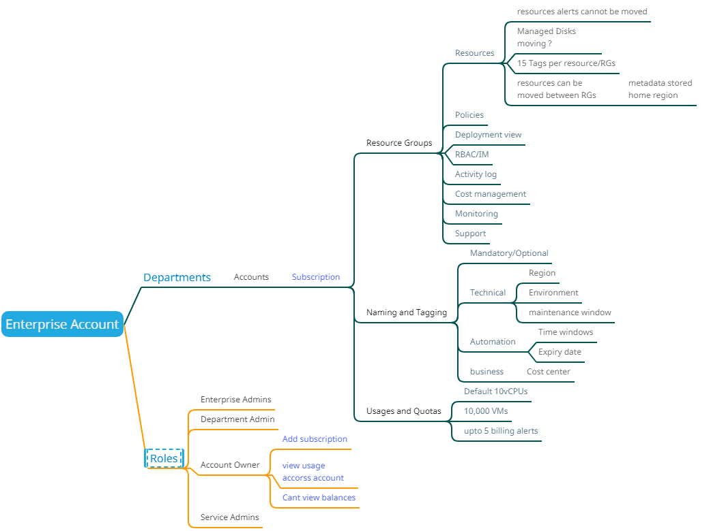
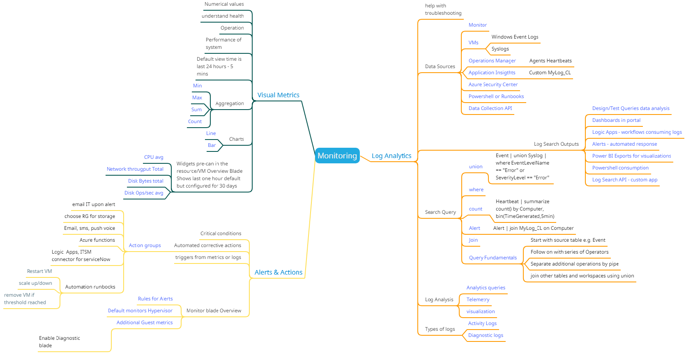

# Azure Resources mind maps 

While preparing for AZ 103 exam I gathered information from online courses like Skyline, LinuxAcadamy and other internet resources. I find that mind maps are a quick way of browsing high level view of the topic or finding for a sub-level topic. Once the hierarchy is established in the mind one can always drill down and research the topics. Below are few mind maps that I am building right now and they are in DRAFT version and may get updated over time or as I learn more.

If anyone find a mistake please raise an issue and I will try to fix it ASAP to the best of my ability. 

## Azure Storage Account

## Azure Enterprise Agreement

## Azure Monitoring

# ARM Templates in Linked Deployments

- [LinkedDeployments](LinkedDeployments)

### Expectations

- [LinkedDeployments](LinkedDeployments) assumes that the deployment account has **owner** rights to a subscription.  This is a less common deployment scenario (possibly development environment) as that account will be highly privilaged and have access to all resource groups.

- AzureRM.* PowerShell modules have been installed (or AZ.* modules with the Enable-AzureRMAlias command run).

### Deployment steps

1. Update each of the `*.parameters.json` files with the appropriate values.
1. Upload the `*.json` and `Update-AutomationAzureModulesForAccount.ps1` files to a blob storage account with public blob read access (for demo purposes only) granted.

    > **Note:** A more secure approach would be to update the **templateStorageContainerUriRoot** and **parametersStorageContainerUriRoot** parameters in `helloworldParent.parameters.json` file to use a SAS token to the storage account instead of assigning public blob read access.  This would require updating the SAS token frequently or using a long lived token.

1. Update `DeployTemplate-Owner.ps1` with the appropriate region, resource group name (only for Contributor scenario), and deployment name.
1. Login to Azure PowerShell to the subscription desired.
1. Run `DeployTemplate-Contributor.ps1` or `DeployTemplate-Owner.ps1` from the context of the folder desired.